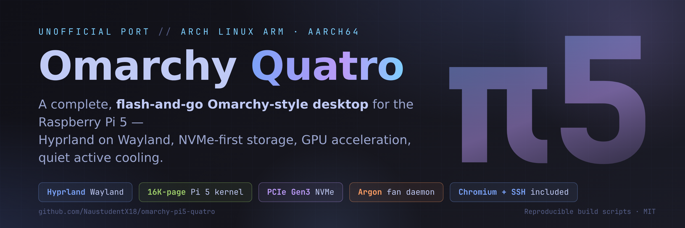
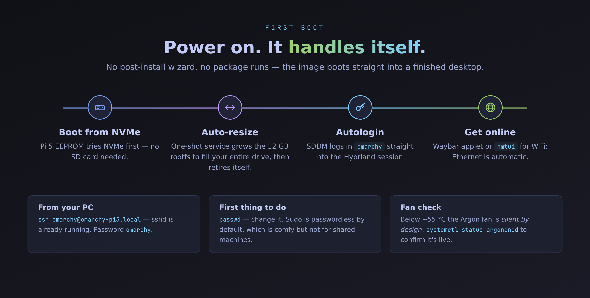

<div align="center">



# Omarchy Quatro

**A complete, flash-and-go [Omarchy](https://github.com/omacom/omarchy)-style desktop for the Raspberry Pi 5.**

Hyprland on Wayland · NVMe-first · GPU-accelerated · fan-cooled · Chromium + SSH baked in

[](https://github.com/NaustudentX18/omarchy-pi5-quatro/releases)
[](#-requirements)
[](#-whats-inside)

[](LICENSE)
[](CONTRIBUTING.md)

> **v1.0.2 note:** the image currently boots the same Omarchy stack on **sway**
> (waybar · fuzzel · mako — Hyprland itself is temporarily unbuildable on Arch
> Linux ARM due to an upstream repo desync, and returns with one
> `pacman -Syu hyprland aquamarine` once it resolves).

**Love [Omarchy](https://github.com/omacom/omarchy) but only have a Pi 5 lying around?** This repo builds you a
bootable Arch Linux ARM image with the same philosophy — a beautiful, batteries-included Hyprland desktop —
tuned specifically for the BCM2712: 16K-page kernel, PCIe Gen 3 NVMe, and the Argon case fan daemon.

> ⚠️ **Unofficial community project.** Not affiliated with Omarchy, DHH, or Basecamp.
> Official Omarchy is x86_64-only — this is an independent ARM port.

</div>

---

## 📖 Contents

- [Why](#-why)
- [Requirements](#-requirements)
- [Install — four steps](#-install--four-steps)
  - [Step 1 — Get the image](#step-1--get-the-image)
  - [Step 2 — Flash it](#step-2--flash-it)
  - [Step 3 — First boot](#step-3--first-boot)
  - [Step 4 — Post-install](#step-4--post-install)
- [What's inside](#-whats-inside)
- [Hardware tuning](#-hardware-tuning)
- [Building from source](#-building-from-source)
- [Troubleshooting](#-troubleshooting)
- [FAQ](#-faq)
- [Repository layout](#-repository-layout)
- [Credits](#-credits)

---

## 🤔 Why

Official [Omarchy](https://github.com/omacom/omarchy) ships x86_64 ISOs only. Meanwhile millions of Pi 5s are
out there with perfectly good Cortex-A76 cores, a GPU, and an NVMe slot. **Omarchy Quatro** closes that gap:

| | Stock Raspberry Pi OS | Omarchy Quatro |
|---|---|---|
| Desktop | PIXEL (LXQt-based) | **Hyprland** tiling Wayland, Omarchy-style |
| Kernel | 4K pages, generic | **16K pages** (`linux-rpi-16k`) — less TLB pressure on A76 |
| Storage | SD-card-first | **NVMe-first**, PCIe **Gen 3** (~850–900 MB/s) |
| Cooling | Manual scripts | **Argon ONE/NEO 5 I²C fan daemon**, silent under 55 °C |
| Packages | apt (Debian) | **pacman** (Arch Linux ARM) — rolling, fresh |
| Extras | — | Chromium, SSH-on-boot, auto-resize, ZRAM, full dev toolset |

It is **not** a shim or a proot container — it's a real, bootable OS image built by
[`build_pi5_image.sh`](build_pi5_image.sh) from a stock [Arch Linux ARM](https://archlinuxarm.org) rootfs.

---

## 📦 Requirements

| Thing | Detail |
|---|---|
| **Raspberry Pi 5** | 4 GB works, 8 GB recommended (ZRAM makes 4 GB fine for daily use) |
| **NVMe SSD** | ≥ 32 GB. The image is 12 GB compressed; first boot expands to fill the drive |
| **USB-NVMe enclosure** | For flashing from your PC — *or* flash from the Pi itself, no PC needed |
| **M.2 HAT / case** | Argon ONE V2/V3, Argon NEO 5, Pimoroni NVMe Base, Pineberry HatDrive, Waveshare… |
| **Power supply** | Official 27 W (USB-C) recommended for NVMe + peripherals |
| **Software** | [Raspberry Pi Imager](https://www.raspberrypi.com/software/) — that's it |

<details>
<summary><b>Can I use an SD card instead?</b></summary>

Yes — flash the same image to an SD card. Everything works; you just give up NVMe speeds.
The first-boot resize grows the rootfs to fill the SD card too. PCIe/Argon features are config-level
and simply won't do anything without the hardware.

</details>

---

## 🚀 Install — four steps


### Step 1 — Get the image

**Option A · Download the prebuilt release** (easiest)

GitHub caps release files at 2 GiB, so the image ships as two parts you join locally:

```bash
# download omarchy-pi5-quatro.img.zst.00 and .01 from the releases page, then:
cat omarchy-pi5-quatro.img.zst.00 omarchy-pi5-quatro.img.zst.01 > omarchy-pi5-quatro.img.zst
sha256sum -c SHA256SUMS          # must print OK
```

➡️ **[Go to Releases](https://github.com/NaustudentX18/omarchy-pi5-quatro/releases)**

**Option B · Build it yourself on your own Pi 5** (~16 min, always fresh)

If you already have *any* bootable Linux on the Pi (even a spare SD card with Raspberry Pi OS):

```bash
sudo apt install -y git parted dosfstools e2fsprogs curl zstd xz-utils   # Debian-based host
git clone https://github.com/NaustudentX18/omarchy-pi5-quatro.git
cd omarchy-pi5-quatro
sudo ./build_pi5_image.sh --fast-compress
# → output/omarchy-pi5-quatro.img.zst + SHA256SUMS
```

That's genuinely the whole build — the script downloads the ALARM rootfs, chroots in, installs the
kernel + desktop, and compresses the result. No Docker, no cross-compile, no x86 machine.

### Step 2 — Flash it

1. Open **Raspberry Pi Imager**
2. **CHOOSE OS → Use custom** → pick `omarchy-pi5-quatro.img.zst`
   (Imager decompresses zstd on the fly — **do not extract it first**)
3. **CHOOSE STORAGE** → your NVMe drive (via USB enclosure)
4. **Write**

> ⚠️ **Skip the "OS customisation" screen** (hostname/WiFi/SSH — press *No*).
> That machinery only works on official Raspberry Pi OS; this image already ships its own
> user, autologin, and SSH config, and Imager's overrides are silently ignored.

<details>
<summary><b>CLI alternatives</b></summary>

```bash
# stream-decompress straight to the drive (no temp file):
zstdcat omarchy-pi5-quatro.img.zst | sudo dd of=/dev/sdX bs=4M status=progress conv=fsync

# or with xz:
xzcat omarchy-pi5-quatro.img.xz | sudo dd of=/dev/sdX bs=4M status=progress conv=fsync
```

Replace `/dev/sdX` with your actual device (`lsblk` to check — **double-check, dd does not ask**).
SHA-256 sums for every artifact are in [`SHA256SUMS`](https://github.com/NaustudentX18/omarchy-pi5-quatro/releases).

</details>

### Step 3 — First boot



- Move the NVMe into your M.2 HAT / Argon case, power on. The Pi 5 EEPROM boots NVMe before SD by default.
- First boot takes ~2 minutes: a one-shot service **grows the root partition to fill the entire drive**, then disables itself.
- You land **autologged into Hyprland** as user `omarchy` (password `omarchy`).
- **WiFi:** click the network applet in the waybar, or run `nmtui`. Ethernet just works.
- **SSH is already running:** `ssh omarchy@omarchy-pi5.local` from your PC.

### Step 4 — Post-install

```bash
passwd                              # change the default password. seriously :)
sudo pacman -Syu                    # bring the rolling release current
systemctl status argononed          # fan daemon (silent < 55°C is normal!)
fastfetch                           # enjoy
```

---

## 🖥️ What's inside


**Desktop:** Hyprland, SDDM (autologin), waybar, fuzzel, mako, swaybg, foot + alacritty,
grim/slurp, wl-clipboard, xdg portals, polkit agent
**Apps:** Chromium, Neovim, tmux, fastfetch, btop, eza, bat, fzf, ripgrep, fd, jq, starship
**System:** PipeWire audio, NetworkManager + applet, BlueZ Bluetooth, openssh,
16K-page Pi 5 kernel + mesa/Vulkan for the VideoCore VII GPU, ZRAM, cloud-utils-growpart

Full manifest: [`desktop/packages.list`](desktop/packages.list)

---

## ⚙️ Hardware tuning

**PCIe Gen 3 NVMe** — `/boot/config.txt` enables `pciex1` at Gen 3, lifting the Pi 5's
PCIe 2.0 lane to ~850–900 MB/s sequential on quality drives.

**Argon fan curve** — `argononed.service` drives the case fan over I²C (`/dev/i2c-1`, addr `0x1a`):

| CPU temp | Fan |
|---|---|
| < 55 °C | 0 % — silent |
| 55–65 °C | 30 % |
| 65–75 °C | 60 % |
| ≥ 75 °C | 100 % |

**Memory** — ZRAM swap (zstd-compressed, half of RAM) plus tuned sysctls
(`vm.swappiness=180`, `page-cluster=0`, watermark tuning) for RAM-first swapping without stalls.

**Boot media** — `config.txt` / `cmdline.txt` use deterministic `PARTUUID`s
(disk signature `0x1974beef`), so boot doesn't shift when drives reorder.

---

## 🔨 Building from source

Native build on the Pi 5 is the proven path (used for every released image):

```bash
sudo ./build_pi5_image.sh --fast-compress   # ~16 min on a Pi 5
```

| Flag | Effect |
|---|---|
| `--fast-compress` | zstd -3 / xz -1 — quick iteration builds |
| *(default)* | Higher compression for slimmer release artifacts |
| `--skip-compress` | Leave a raw `.img` only |

<details>
<summary><b>Docker (advanced / x86 cross-build)</b></summary>

```bash
./build_docker.sh
```

Cross-building from an x86 host works but needs `binfmt_misc` qemu-aarch64 registration on the
**host**, and is markedly slower than a native Pi 5 build. The Pi is the reference environment.

</details>

The build is fully scripted and reproducible: ALARM rootfs download → partition/loop-mount →
chroot (keyring init, Landlock-safe pacman config, kernel swap to `linux-rpi-16k`, package
manifest install, Omarchy config + user + services) → post-chroot `config.txt` re-injection
(the kernel package clobbers it) → zerofree/zero-fill → compress → SHA256SUMS.

---

## 🔧 Troubleshooting

<details>
<summary><b>Won't boot from NVMe</b></summary>

Check the EEPROM boot order on any bootable medium:

```bash
rpi-eeprom-config          # BOOT_ORDER should include 6 (NVMe), e.g. 0xf61
sudo rpi-eeprom-config --edit   # set BOOT_ORDER=0xf61
```

Also try a different USB3 cable/enclosure port, and confirm the drive appears in `lsblk`.
</details>

<details>
<summary><b>No video output</b></summary>

Give first boot 2–3 minutes (it's resizing the filesystem). Then check that your monitor
cable is in the ** HDMI 0 port** (closest to the power jack) — that's the firmware default.
</details>

<details>
<summary><b>Fan never spins</b></summary>

Silent below 55 °C is by design. Verify the daemon and I²C:

```bash
systemctl status argononed
sudo i2cdetect -y 1        # Argon controller shows up at 0x1a
journalctl -u argononed -b
```
</details>

<details>
<summary><b>Rootfs didn't grow to full size</b></summary>

```bash
lsblk                       # root partition should ≈ disk size
systemctl status rpi-resizerootfs
sudo systemctl start rpi-resizerootfs   # re-run manually
```
</details>

<details>
<summary><b>SSH refused</b></summary>

sshd is enabled at boot. If `.local` doesn't resolve, use the IP from the waybar network
applet tooltip or your router: `ssh omarchy@<ip>`. Password is `omarchy` until you change it.
</details>

<details>
<summary><b>Flashed v1.0.0 and got a black screen?</b></summary>

v1.0.0 had an MBR signature byte-order bug: the kernel resolved partitions as
<code>efbe7419-01/02</code> while <code>cmdline.txt</code> rooted to <code>1974beef-02</code>, so the boot stalled
waiting for a root device that never appeared. <b>Re-flash with v1.0.1+</b> — or fix in place
without re-downloading by rewriting 4 bytes at MBR offset 440 on any Linux box:

```bash
printf '\xef\xbe\x74\x19' | sudo dd of=/dev/sdX bs=1 seek=440 count=4 conv=notrunc
```

(Point <code>/dev/sdX</code> at the whole drive, verify with <code>blkid</code>: PARTUUIDs should read
<code>1974beef-01/02</code>.)
</details>

---

## ❓ FAQ

<details>
<summary><b>Is this official Omarchy?</b></summary>

No. It's an independent community port inspired by [Omarchy](https://github.com/omacom/omarchy)'s
desktop, built on Arch Linux ARM. Official Omarchy targets x86_64 only.
</details>

<details>
<summary><b>Do I need Raspberry Pi OS first?</b></summary>

No — the image <b>is</b> the complete OS. Flash it directly and boot.
</details>

<details>
<summary><b>Do I need to unzip the image?</b></summary>

No. Raspberry Pi Imager decompresses <code>.zst</code>/<code>.xz</code> while writing. Flash the file as-is.
</details>

<details>
<summary><b>Why a 16K-page kernel?</b></summary>

ARM64 kernels can run 4K or 16K pages. On Cortex-A76 (Pi 5), 16K pages reduce TLB pressure and
page-table walk overhead for memory-heavy workloads. It's the same kernel Raspberry Pi OS ships
for the Pi 5 — paired here with the full Arch ARM userland.
</details>

<details>
<summary><b>Default credentials?</b></summary>

User <code>omarchy</code>, password <code>omarchy</code>, sudo NOPASSWD — set for a smooth first run.
Change the password immediately (built for a hobbyist single-user board, not shared machines).
</details>

<details>
<summary><b>Where are the screenshots?</b></summary>

Diagrams here are generated from the repo's actual configuration. Real Hyprland screenshots vary
by setup — community submissions are very welcome via PR!
</details>

---

## 📁 Repository layout

```
omarchy-pi5-quatro/
├── build_pi5_image.sh      # master image builder — steps 1–9, loop-device based
├── build_docker.sh         # optional privileged-container build runner
├── Dockerfile              # build container image
├── pi-imager-os-list.json  # Raspberry Pi Imager custom OS list entry
├── argon/                  # Argon ONE/NEO 5 fan daemon + systemd unit
├── resize/                 # first-boot rootfs auto-expander + unit
├── system_tuning/          # ZRAM config + Pi 5 sysctl profile
├── config/                 # /etc/fstab injected into the image
├── desktop/                # packages.list manifest + Omarchy setup scripts
└── assets/                 # README artwork (generated from repo config)
```

---

## 🙏 Credits

- [Omarchy](https://github.com/omacom/omarchy) by DHH & community — the desktop philosophy and configs this port draws from
- [Arch Linux ARM](https://archlinuxarm.org) — the userland foundation
- [Argon40](https://argon40.com) — case hardware + fan protocol
- Raspberry Pi Foundation — EEPROM/boot tooling and docs

## 📜 License

[MIT](LICENSE) — build it, flash it, fork it, sell it on a shelf if you want.

<div align="center">
<br><br>
<b>If this saved you a weekend, a ⭐ helps other Pi 5 owners find it.</b>
</div>
