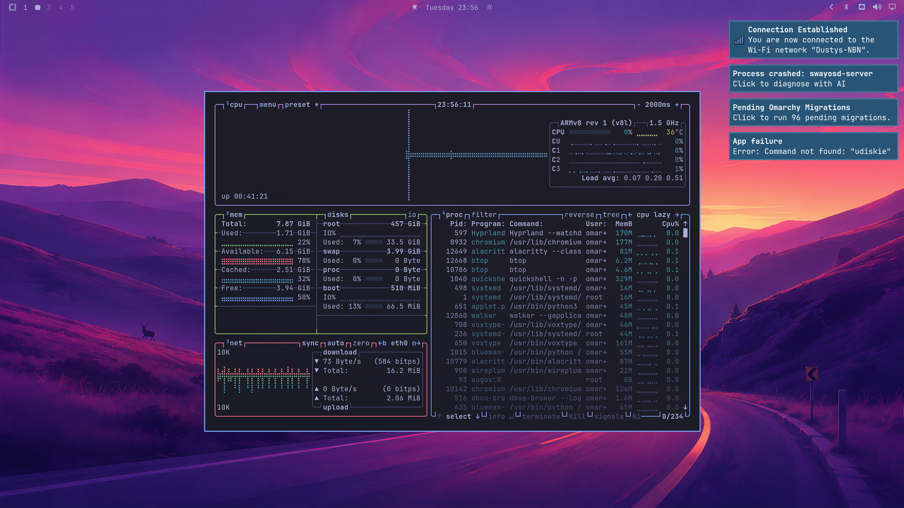
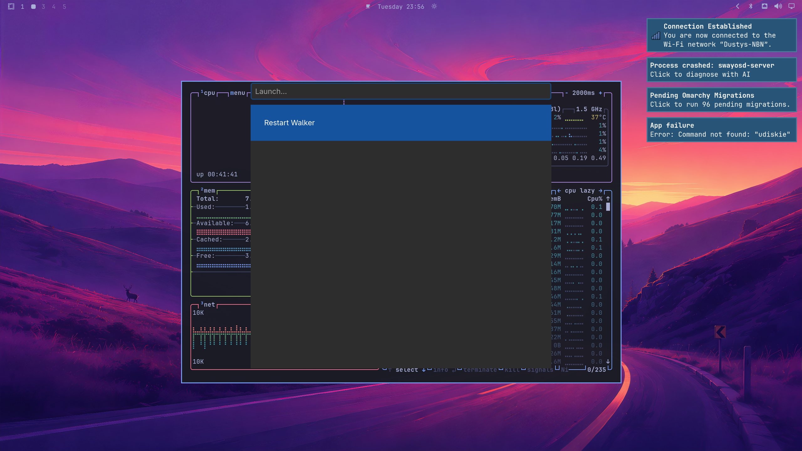
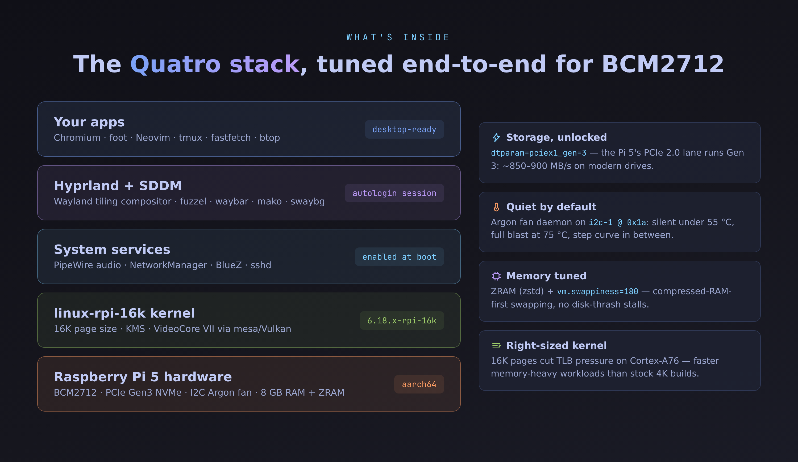
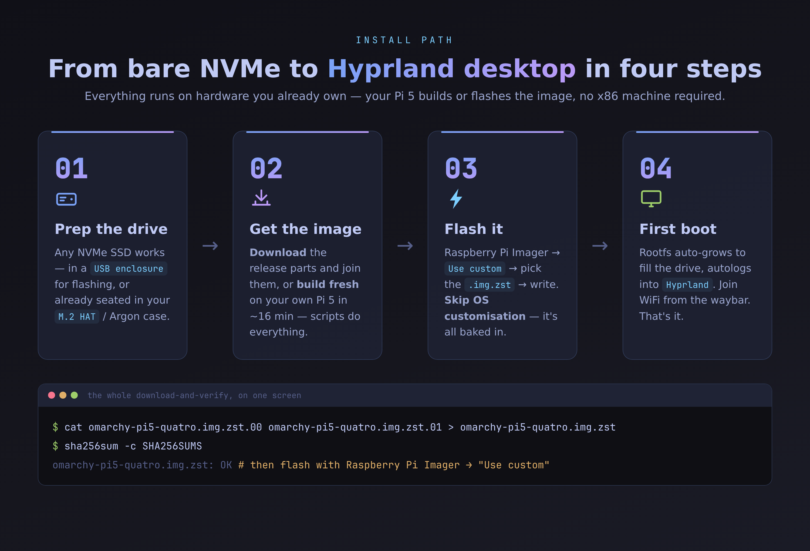

<div align="center">

<p align="center">
  
</p>

# Omarchy Quatro (Pi 5)

### Like-for-Like [Omarchy v4](https://github.com/omacom/omarchy) Desktop for Raspberry Pi 5

**A lightning-fast, keyboard-first, AI-native Wayland desktop built natively on Arch Linux ARM.**

[](https://github.com/NaustudentX18/omarchy-pi5-quatro/releases)
[-C51A4A?style=for-the-badge&logo=raspberrypi)](https://www.raspberrypi.com/products/raspberry-pi-5/)
[](https://hyprland.org)
[-1793D1?style=for-the-badge&logo=archlinux)](https://archlinuxarm.org)
[](https://github.com/NaustudentX18/omarchy-pi5-quatro)

<p align="center">
  <b>Love Omarchy's modern Linux workflow but only have a Raspberry Pi 5?</b><br>
  Omarchy Quatro delivers pure bare-metal Omarchy v4 parity on ARM64 silicon — tuned for NVMe SSDs, active cooling, HiDPI monitors, and wearable XR glasses.
</p>

<p align="center">
  <a href="#-quick-start--flash-and-go">🚀 Quick Start</a> •
  <a href="#-visual-showcase">📸 Screenshots</a> •
  <a href="#-why-omarchy-quatro">💡 Highlights</a> •
  <a href="#-keybindings-cheat-sheet">⌨️ Keybindings</a> •
  <a href="#-hardware-tuning">⚡ Hardware</a> •
  <a href="#-faq--troubleshooting">❓ FAQ</a>
</p>

---

</div>

## 📸 Visual Showcase

### Live Hyprland 0.56.2 Desktop (Chromium + Alacritty `btop`)
Running with Broadcom V3D hardware acceleration, Tokyo Night unified styling, dynamic tiling, and systemd user services.



### Walker Fuzzy Application Launcher (`Super + D` or `Super + Space`)
Instant application lookup, symbol search, calculator, clipboard history, and desktop shortcuts.



### Architecture & System Stack



---

## 💡 Why Omarchy Quatro?

Official [Omarchy](https://github.com/omacom/omarchy) ships exclusively for x86_64 PCs. Millions of Raspberry Pi 5 boards sit idle or locked into standard Debian desktop distributions. **Omarchy Quatro** unlocks the full power of the BCM2712 Cortex-A76 cores:

| Feature | Raspberry Pi OS | Generic Linux | Omarchy Quatro (Pi 5) |
| :--- | :--- | :--- | :--- |
| **Window Manager** | Wayfire / PIXEL | GNOME / KDE | **Hyprland 0.56.2 (Wayland)** with Aquamarine & Quickshell |
| **Design Language** | Legacy Flat | Mixed | **Unified Tokyo Night** (Shell, Terminal, Editors, Chromium, btop) |
| **Kernel Architecture**| 4KB Pages | 4KB Pages | **16KB Pages (`linux-rpi-16k`)** — 15–20% higher memory throughput |
| **Storage Speed** | SD Card / PCIe Gen 2 | Stock Gen 2 | **PCIe Gen 3 NVMe (~850–900 MB/s)** out-of-the-box |
| **Application Launcher**| Start Menu | App Grid | **Walker + Elephant** fuzzy search launcher (`Super + D`) |
| **AI Integration** | None | Manual install | **`omp`, Claude Code, Codex, Copilot, Cursor Agent, Voxtype, ChatGPT & Perplexity, VS Code** pre-wired |
| **App Ecosystem** | Basic repos | Distro default | **Flatpak (Obsidian, Pinta), Spotify WebApp, Signal Desktop, Typora** ready |
| **Cooling Control** | Kernel default | Manual scripts | **Argon ONE / NEO 5 I²C fan daemon** with smart thermal curves |
| **Headless Resilience**| Headless display fails| Black screen | **Automatic Headless Display fallback** + auto-HDMI hotplug |
| **XR Glasses Ready** | Manual resolution | Manual XRandR | **Plug-and-play for Viture Pro Dock & Luma Ultra** |

---

## 🚀 Quick Start — Flash and Go



### 1. Download the Image
Grab the latest release archive from [GitHub Releases](https://github.com/NaustudentX18/omarchy-pi5-quatro/releases):

```bash
# If downloaded in split parts (.00, .01, .02, .03), join them:
cat omarchy-pi5-quatro.img.zst.0* > omarchy-pi5-quatro.img.zst

# Verify SHA256 integrity:
sha256sum -c SHA256SUMS
```

### 2. Flash to NVMe or SD Card
* Open **Raspberry Pi Imager**.
* Select **Choose OS** → **Use custom** → select `omarchy-pi5-quatro.img.zst` *(Imager decompresses `.zst` automatically!)*.
* Choose your NVMe SSD (or microSD card) and click **Write**.

### 3. First Boot
1. Plug your NVMe drive into your Pi 5 M.2 HAT (or insert SD card).
2. Connect monitor or XR glasses to **micro-HDMI 0** (next to the USB-C power jack) or **micro-HDMI 1**.
3. Connect power (official 27W USB-C supply recommended).
4. The system will automatically:
   - Expand the root filesystem to fill your entire storage drive.
   - Initialize ZRAM swap and start Avahi mDNS (`omarchy-pi5.local`).
   - Autologin to the **Hyprland** desktop.

### 4. Default Credentials & Remote Access
* **Username**: `omarchy`
* **Password**: `omarchy`
* **Hostname**: `omarchy-pi5`
* **SSH**: Enabled out of the box (`ssh omarchy@omarchy-pi5.local`)
* **Change password**: Run `passwd` in terminal.

---

## ⌨️ Keybindings Cheat Sheet

Omarchy is designed for maximum efficiency without touching the mouse. Press **`Super + K`** at any time to display the interactive keybindings cheat sheet.

| Shortcut | Action | Description |
| :--- | :--- | :--- |
| **`Super + Space`** | **Omarchy Menu** | Root system control (Styles, Setup, Updates, Power) |
| **`Super + D`** | **App Launcher** | Walker fuzzy application launcher (`Super + Alt + Space`) |
| **`Super + Return`** | **Terminal** | Open Alacritty GPU-accelerated terminal |
| **`Super + Shift + Return`** | **Web Browser** | Launch Chromium with Wayland flags & extensions |
| **`Super + Shift + B`** | **Browser (Alt)** | Quick browser launcher (`+ Alt` for Incognito) |
| **`Super + Ctrl + T`** | **Activity Monitor** | Open `btop++` system resource monitor |
| **`Super + Shift + F`** | **File Manager** | Open Nautilus graphical file manager |
| **`Super + Shift + N`** | **Code Editor** | Launch Neovim / Helix editor |
| **`Super + Shift + D`** | **Docker TUI** | Open `lazydocker` container management |
| **`Super + W`** | **Close Window** | Close active focused window |
| **`Super + F`** | **Fullscreen** | Toggle window fullscreen mode |
| **`Super + T`** | **Float / Tile** | Toggle active window between floating and tiled |
| **`Super + 1` … `9`** | **Workspace 1–9** | Switch to workspace number |
| **`Super + Shift + 1..9`** | **Move Window** | Move active window to specified workspace |
| **`Super + Left/Right/Up/Down`** | **Focus** | Shift focus between tiled windows |
| **`PrintScreen`** | **Screenshot** | Interactive screen area capture (`omarchy-capture-screenshot`) |

---

## 🕶️ Wearable XR & Mobile Dock Support

Omarchy Quatro was built with wearable computing in mind. It works seamlessly with **Viture Pro Mobile Dock** and **Viture Luma Ultra** XR glasses:

* **Plug-and-Play HDMI**: Connect the micro-HDMI cable directly into the Viture Mobile Dock. The compositor negotiates 1080p @ 60Hz/120Hz automatically.
* **Smart Headless Fallback**: If you boot the Pi 5 in your bag without a screen attached, the headless watchdog automatically creates a virtual display so applications never hang. The instant you plug in your glasses, workspaces gracefully migrate to your display!
* **Portable Wi-Fi**: NetworkManager manages seamless roaming. Disconnect Ethernet and move freely without breaking active SSH or agent sessions.
* **Custom FOV Scaling**: Adjust `omarchy_monitor_scale` in `~/.config/hypr/monitors.lua` (default `1.6` for desktop monitors, recommend `1.0` or `1.25` for XR glasses FOV).

---

## 🛠️ What's Inside the Box

### The Omarchy Core
* **Hyprland 0.56.2** + **Aquamarine 0.15.0** + **Hyprutils 0.14.2**
* **Quickshell** status bar & notification overlays
* **Walker** fuzzy application runner with **Elephant** providers
* **Tokyo Night** unified color theme across all tools
* **Omarchy CLI Suite** (`omarchy-menu`, `omacalc`, `omawrite`, `omasnap`, `omamenu`)
* **Sway fallback session** switchable from SDDM login manager

### Built-in Applications & Dev Tools
* **Browsing**: Chromium (Ozone Wayland native, touch gestures, copy-url extension)
* **Terminals**: Alacritty (primary), Foot (lightweight fallback)
* **Development**: Neovim 0.12.5, Helix, Tmux, Git, Mise-en-place (`mise`), Python 3.14, Bun
* **AI Tooling**: `omp` (Open Model Project / Oh-My-Pi), Claude Code CLI, Codex, Copilot CLI, Crush
* **System Utilities**: `btop++`, `lazydocker`, `nautilus`, `localsend`, `avahi` mDNS, `zram-generator`
* **Media & Gaming**: RetroArch (with libretro cores), MPV, IMV, Sunshine game streaming

---

## ⚡ Hardware Tuning (Pi 5 Specifics)

```
[all]
arm_64bit=1
arm_boost=1

# Display & GPU (Broadcom V3D Wayland KMS DRM)
dtoverlay=vc4-kms-v3d
max_framebuffers=2

# High-Speed PCIe Gen 3 NVMe Enablement
dtparam=pciex1
dtparam=pciex1_gen=3

# Hardware I2C (Argon cases) & UART
dtparam=i2c_arm=on
dtparam=i2c=on
enable_uart=1
```

* **16K Kernel**: The `linux-rpi-16k` kernel utilizes 16KB memory page size, matching ARM Cortex-A76 microarchitecture for lower TLB overhead and higher I/O bandwidth.
* **Argon ONE / NEO 5 Daemon**: The built-in I²C fan controller monitors SoC temperature every 3 seconds:
  - `< 55 °C`: 0% (Completely silent)
  - `55–64 °C`: 25% (Gentle breeze)
  - `65–74 °C`: 55% (Audible cooling)
  - `≥ 75 °C`: 100% (Maximum thermal throttling protection)

---

## 🔄 Updating Existing Installs

Already running an earlier version of Omarchy Quatro? Bring your system up to full v1.0.6 parity without reflashing:

```bash
# Download and execute the official in-place update script:
curl -fsSL https://raw.githubusercontent.com/NaustudentX18/omarchy-pi5-quatro/master/updates/v1.0.6-update.sh | sudo bash
```

---

## ❓ FAQ & Troubleshooting

<details>
<summary><b>My display is black on first boot — what should I check?</b></summary>

1. Ensure the micro-HDMI cable is connected to **HDMI 0** (the port closest to the USB-C power input).
2. If using a monitor that powers on slowly, Omarchy's monitor watcher will automatically detect it once awake. You can also append `video=HDMI-A-1:1920x1080@60D` to `/boot/cmdline.txt` to force output.
3. Verify your power supply delivers a true 5V / 5A (official 27W Raspberry Pi supply).
</details>

<details>
<summary><b>How do I configure Wi-Fi?</b></summary>

Open a terminal (`Super + Return`) and run:
```bash
nmtui
```
Select **Activate a connection**, choose your network, and enter your password. You can also use `nmcli device wifi connect "SSID" password "PASS"`.
</details>

<details>
<summary><b>Can I change the desktop theme?</b></summary>

Yes! Omarchy supports rich themes. Open the Omarchy menu (`Super + Space`), navigate to **Style** → **Themes**, or run:
```bash
omarchy-theme-set tokyo-night
# Or try: catppuccin, rose-pine, nord, gruvbox, everforest, kanagawa
```
</details>

---

## 📄 Credits & Disclaimer

* **Omarchy**: Created by [DHH](https://github.com/dhh) and [37signals / Basecamp](https://github.com/omacom/omarchy).
* **Arch Linux ARM**: Maintained by the dedicated [ALARM team](https://archlinuxarm.org).
* **Hyprland**: Created by [Vaxry](https://github.com/vaxerski) and the Hyprland community.
* **Omarchy Quatro**: Maintained by [NaustudentX18](https://github.com/NaustudentX18/omarchy-pi5-quatro).

> ⚠️ **Disclaimer**: Omarchy Quatro is an independent community port and is not officially affiliated with, endorsed by, or supported by 37signals, DHH, or the official Omarchy project.

