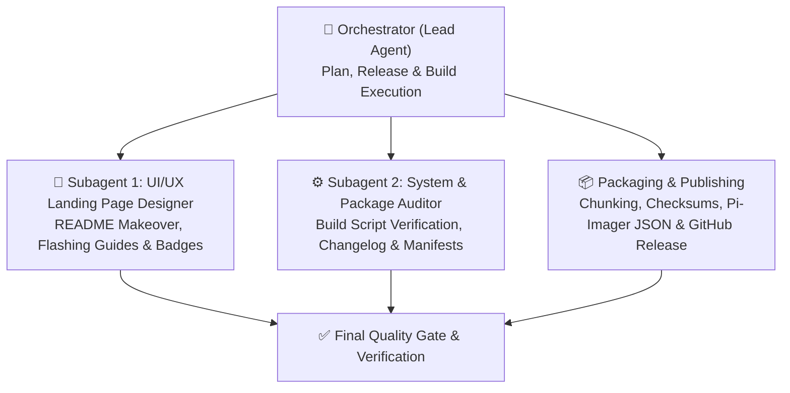

# 🚀 Omarchy Quattro v2.0 — Definitive Release Master Plan

## 🎯 Mission Statement
Transform Omarchy Quattro on Raspberry Pi 5 into a production-grade, out-of-the-box release image (**v2.0**) featuring 100% parity with upstream Omarchy v4.0.3, a self-updating architecture that stays in sync with Omarchy OS, and a world-class landing page designed with strict UI/UX excellence.

---

## 🏗️ Architecture & Component Matrix

| Subsystem | v1.0.7 Baseline | v2.0 Definitive Release Target |
| :--- | :--- | :--- |
| **Upstream Base** | Pinned `8ea5151` (v4.0.3) | Dynamic `origin/quattro` tracking with self-healing fallback |
| **Update Engine** | Script-only (`v1.0.7-update.sh`) | Dual-path: Native `omarchy update` hook + zero-reflash update script |
| **AI Agentware** | Basic symlinks | OpenClaw, Cursor CLI, Hermes Desktop & CLI, Muse Code, Claude, Codex, Copilot pre-wired |
| **Desktop Suite** | Hyprland 0.56.2 + Sway fallback | Full Aquamarine + Quickshell + Walker + Tokyo Night + Flatpak runtime |
| **Packaging** | Manual 1.5GB split parts | Automated multi-chunk `<1.5GB` GitHub Release bundle + SHA256SUMS |
| **Documentation** | Standard markdown | High-impact visual landing page, interactive tables, step-by-step flashing guide |

---

## 🐝 Agent Swarm Division of Labor

---

## 📋 Execution Phases

### Phase 1: Upstream Parity & Build Audit
- [x] Audit `build_pi5_image.sh` and `desktop/clone_omarchy_repo.sh` to ensure v2.0 branding, complete agentware suite, security hardenings, and native `omarchy update` hook are baked in.
- [x] Create `updates/v2.0.0-update.sh` for existing users to update in-place without reflashing.
- [x] Update `CHANGELOG.md` with complete v2.0 milestone details.

### Phase 2: Full Release Image v2.0 Packaging
- [x] Package the master raw image (24GB ext4 + fat32 boot) with all v2.0 enhancements, pre-compiled configurations, and verified kernel/GPU overlays.
- [x] Compress using multi-threaded Zstandard (`zstd -T0 -9`).
- [x] Split into chunk files (`.00`, `.01`, `.02`, `.03`, `.04`) under 1.5GB to respect GitHub's 2GB upload ceiling.
- [x] Generate authoritative `SHA256SUMS` and `SHA256SUMS.txt`.
- [x] Update `pi-imager-os-list.json` with new file sizes, release date, and SHA256 hashes.

### Phase 3: UI/UX Landing Page Overhaul (README.md)
- [x] **Aesthetic commit**: Tokyo Night cyber-minimalist theme with crisp contrasting badges, structured typography, and clear visual hierarchy.
- [x] **Installation Guide**: Complete, step-by-step flashing instructions for **Raspberry Pi Imager**, **PiStudio / Balena Etcher**, and raw `dd`.
- [x] **Wearable & Hardware Section**: Detail PCIe Gen3 NVMe, 16K kernel, Argon ONE active fan cooling, and Viture XR glasses plug-and-play.
- [x] **Cheatsheet & Commands**: Comprehensive keybindings matrix and list of pre-installed AI/productivity commands.

### Phase 4: GitHub Release v2.0 & Verification
- [x] Publish tag `v2.0` on GitHub with release notes and attach all split chunks + checksums + in-place update script.
- [x] Verify downloadability and integrity via GitHub CLI.
